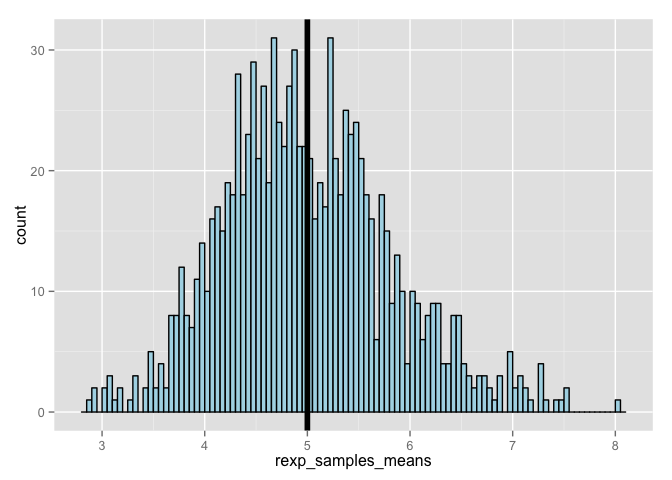
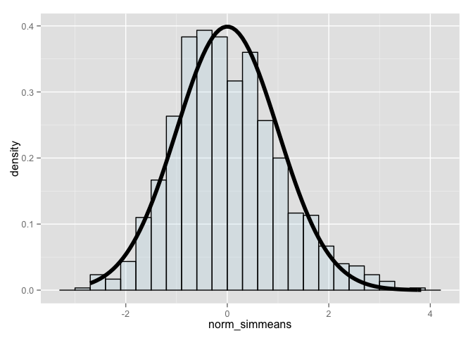

# Statistical Inference Course Project
Telvis Calhoun  
January 29, 2016  

## Overview

In this project, we investigate the exponential distribution in R and compare it with the Central Limit Theorem. The exponential distribution can be simulated in R with `rexp(n, lambda)` where `lambda` is the rate parameter. The mean of exponential distribution is `1/lambda` and the standard deviation is also `1/lambda`.

## Simulations

We generate simulated data using the `rexp` function to calcuate the sample mean of 40 random exponentials where `lambda = 0.2`. We run 1000 simulations.


```r
  # 1000 simulations
  nosim <- 1000
  
  # num samples per simulation
  n <- 40
  
  # lambda
  lambda <- 0.2
  
  # calc the means
  mean.pop <- 1/lambda
  
  # calc the variance
  var.pop <- 1/lambda

  # Generate simulated data
  rexp_samples <- matrix(rexp(n*nosim, rate=lambda), nosim, n)
  
  # Calc sample means for the 1000 simulations
  rexp_samples_means <- matrix(apply(rexp_samples, 1, mean))
```

The theoretical mean is 5. The theoretical variance is 5.

## Sample Mean versus Theoretical Mean

Now that we have simulated data, let's compare the sample mean to the theoretical mean of the distribution. The plot shows that the distribution of the sample mean is centered about population mean of 5. 

```r
library(ggplot2)

g = ggplot(data.frame(rexp_samples_means = rexp_samples_means), aes(x = rexp_samples_means))
g = g + geom_histogram(color = "black", fill = "lightblue", binwidth = 0.05)
g = g + geom_vline(size=2, xintercept = 1/lambda)
print(g)  
```

 


## Sample Variance versus Theoretical Variance

Now let's compare the sample variance to the theoretical variance of the distribution. The variance of the sample mean is the theoretical variance divided by $n$.


```r
sample_var <- var(rexp_samples_means)
theoretical_var <- (1/lambda)^2/n
```

The sample variance is 0.6778728 which is reasonably close to the theoretical variance of 0.625.

### Distribution
Finally, let's show that the distribution of sample means is approximately the distribution of the standard normal. We'll apply the `Central Limit Theorem` to the sample means to show its distribution is similar to the standard normal distribution for a large $n$.

We use the `cfunc` method to apply the CLT to our sample means.


```r
cfunc <- function(x) {
  n <- 40
  lambda <- 0.2
  mu <- 1/lambda
  
  # variance
  variance <- (1/lambda) ^ 2
  
  # standard error of the mean
  sem <- sqrt(variance/n)
  
  # CLT
  x_norm <- (x - mu) / sem
  x_norm
}

norm_simmeans <- apply(rexp_samples_means, 1, cfunc)
```

The plot shows the distibution of the sample means after applying the CLT. This distribution is centered at `0` and is approximately bell-shaped.


```r
g <- ggplot(data.frame(norm_simmeans=norm_simmeans), aes(x = norm_simmeans)) 
g<- g + geom_histogram(alpha = .20, 
                       binwidth=.3, 
                       fill = "lightblue", 
                       colour = "black", 
                       aes(y = ..density..))
g <- g + stat_function(fun = dnorm, size = 2)
print(g)
```

 
