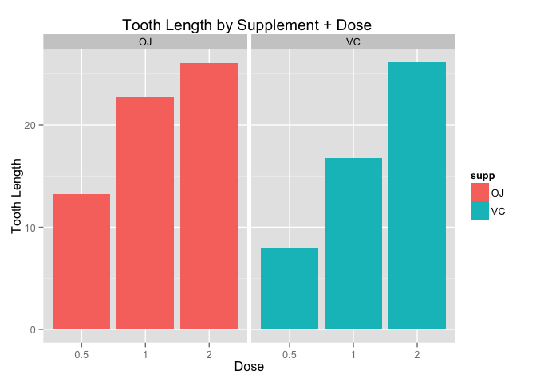

# Statistical Inference Project: Toothgrowth Data Analysis
Telvis Calhoun  
January 29, 2016  

## Overview

In this project, we explore the `ToothGrowth` dataset. This dataset shows the length of odontoblasts (teeth) in each of 10 guinea pigs at each of three dose levels of Vitamin C (0.5 mg, 1 mg, and 2 mg) with each of two supplements (orange juice or ascorbic acid).

## Exploratory Analysis

First, lets load libraries and datasets used in the analysis.


```r
library(datasets)
library(ggplot2)
library(dplyr)
library(reshape2)

data("ToothGrowth")
```

A quick `summary` shows the `ToothGrowth` dataset has 3 columns. `len` is a continuous variable that is a function of the discrete variables: `supp` and `dose`. Let's calculate the mean `len` for each `supp` and `dose`.


```r
summary(ToothGrowth)
```

```
##       len        supp         dose      
##  Min.   : 4.20   OJ:30   Min.   :0.500  
##  1st Qu.:13.07   VC:30   1st Qu.:0.500  
##  Median :19.25           Median :1.000  
##  Mean   :18.81           Mean   :1.167  
##  3rd Qu.:25.27           3rd Qu.:2.000  
##  Max.   :33.90           Max.   :2.000
```

```r
mean_supp_dose <- dcast(melt(ToothGrowth, id=c("supp", "dose"), 
                               measure.vars = "len"), 
                        supp+dose ~ variable, mean)
mean_supp_dose
```

```
##   supp dose   len
## 1   OJ  0.5 13.23
## 2   OJ  1.0 22.70
## 3   OJ  2.0 26.06
## 4   VC  0.5  7.98
## 5   VC  1.0 16.77
## 6   VC  2.0 26.14
```

A plot of `mean_supp_dose` shows mean tooth length increases at each dose level for both supplements.

 

## Assumptions
We assume that the tooth length measurements in the `OJ` and `VC` groups are statistically independent and are not paired. We also assume that two groups have unequal variances.

## Supplement Comparison

Now let's compare the tooth lengths by supplement, keeping the dosage constant. `t.test` returns the 95% confidence interval estimate for the mean change in tooth length for each supplement.


```r
  rbind(
    c(0.5, t.test(len ~ supp, paired=FALSE, var.equal=FALSE, 
                  data=subset(ToothGrowth, dose==0.5))$conf),
    c(1.0, t.test(len ~ supp, paired=FALSE, var.equal=FALSE, 
                  data=subset(ToothGrowth, dose==1.0))$conf),
    c(2.0, t.test(len ~ supp, paired=FALSE, var.equal=FALSE, 
                  data=subset(ToothGrowth, dose==2.0))$conf)
  )
```

```
##      [,1]      [,2]     [,3]
## [1,]  0.5  1.719057 8.780943
## [2,]  1.0  2.802148 9.057852
## [3,]  2.0 -3.798070 3.638070
```


The confidence intervals for `0.5 mg` and `1 mg` do not include 0; therefore we reject the null hypothesis in favor of the alternative. The confidence interval for `2 mg` contains 0, so we fail to reject the null hypothesis for that dose. This suggests that the guinea pigs have greater tooth growth with `OJ` as a vitamin C supplement for the `0.5 mg` and `1 mg` doses.

## Dosage Comparison

Now let's compare the tooth lengths by dosage, keeping the supplement constant. `t.test` returns the 95% confidence interval estimate for the mean change in length for each dosage.


```r
ret <- matrix(nrow=0, ncol=5)
  for (supp_ in c("VC", "OJ")){
    ret <- rbind(
        ret,
        c(supp_,
          0.5,
          1.0,
          t.test(subset(ToothGrowth, dose==1.0 & supp==supp_)$len, 
                 subset(ToothGrowth, dose==0.5 & supp==supp_)$len, 
                 var.equal = FALSE)$conf),
        c(supp_,
          1.0,
          2.0,
          t.test(subset(ToothGrowth, dose==2.0 & supp==supp_)$len, 
                 subset(ToothGrowth, dose==1.0 & supp==supp_)$len, 
                 var.equal = FALSE)$conf)
      )
  }
ret  
```

```
##      [,1] [,2]  [,3] [,4]                [,5]              
## [1,] "VC" "0.5" "1"  "6.31428795681282"  "11.2657120431872"
## [2,] "VC" "1"   "2"  "5.68573333641802"  "13.054266663582" 
## [3,] "OJ" "0.5" "1"  "5.52436563884644"  "13.4156343611536"
## [4,] "OJ" "1"   "2"  "0.188557466573025" "6.53144253342697"
```

The confidence intervals are above 0.0 for all dosage increases except for the `OJ` dosage increase from `1 mg` to `2 mg`, so we reject the null hypothesis for all except that dosage. This suggests that the guinea pigs have greater tooth growth with dosage increase from `0.5 mg` to `1.0 mg` for both supplements and `1 mg` to `2 mg` for ascorbic acid.

## Conclusion

The `t.test` confidence intervals indicate that odontoblasts for 10 guinea pigs in the study had greater length when given vitamin C via orange juice. The results also show that an increase in dosage contributed to greater tooth length for all except 1 case.

 
